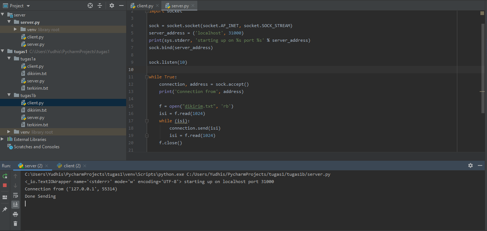

# Tugas 1

* Menjalankan Server dengan 3 port yang berbeda. Ip server = 10.151.253.43 dan Ip Client = 10.151.253.161 dengan mengirimkan pesan "PEMOROGRAMAN JARINGAN TEKNIK INFORMATIKA"

             
*Hasilnya

#### Port 31000
##### Server (Wait)

##### Client (Connect)

#### Server (Sent)

#### Port 31001
##### Server (Wait)

##### Client (Connect)

#### Server (Sent)

#### Port 31002

##### Server (Wait)

##### Client (Connect)

#### Server (Sent)

## Tugas 1a
Mentransfer file dari client ke server

#### Client mengirim file

#### Server Menerima file

#### File yang dikirim dan terkirim

## Tugas 1b
Mentransfer file yang direquest client ke server

#### Client mengirim file

#### Server Menerima file

#### File yang dikirim dan terkirim

