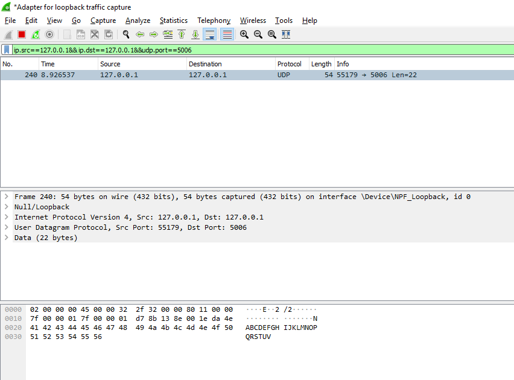
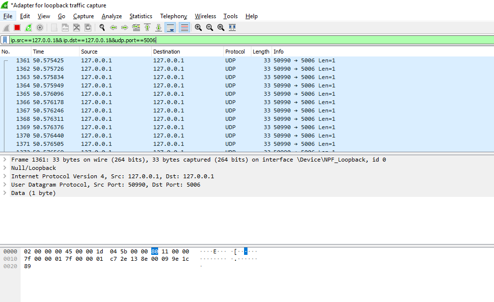
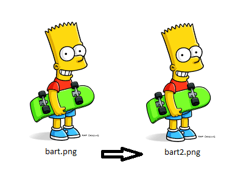
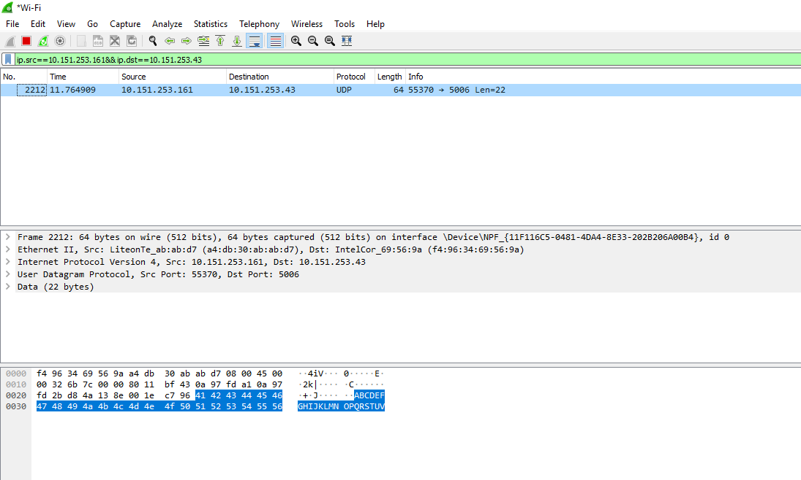
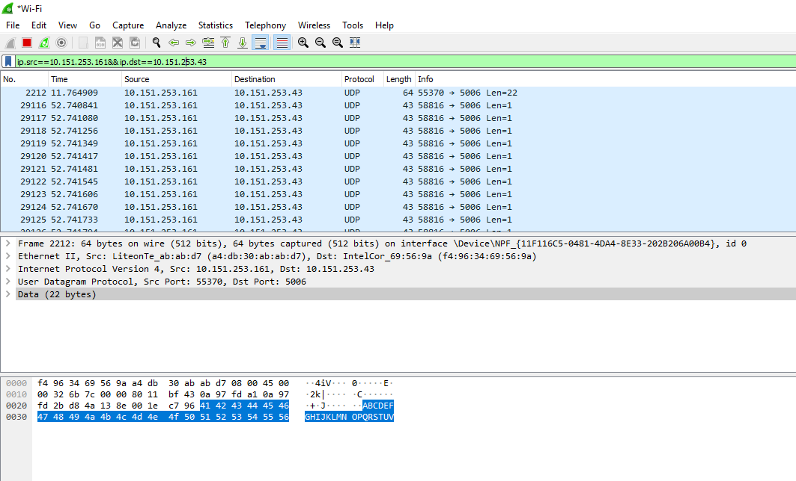

# Tugas 2

* Menjalankan udp_simple.py dengan ip localhost dan port 5006 dengan teks "ABCDEFGHIJKLMNOPQRSTUV"

* Menjalankan udpfileclient.py dengan ip localhost dan port 5006 dengan mengirimkan file gambar

* Menjalankan udpsimple.py ke alamat ip 10.151.253.43 dengan port 5006 dengan teks "ABCDEFGHIJKLMNOPQRSTUV"

* Menjalankan udpfileclient ke alamat ip 10.151.253.43 dengan port 5006

