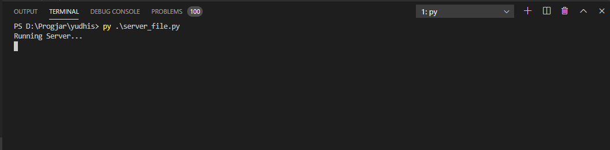
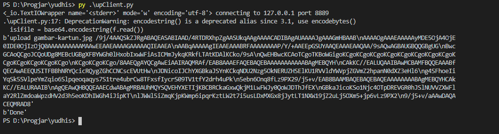
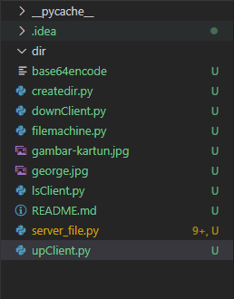
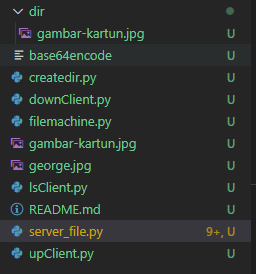
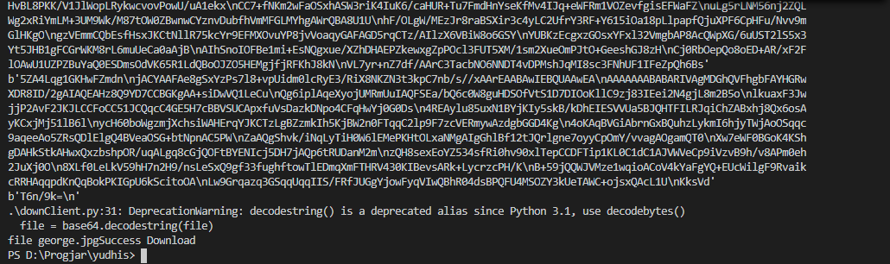
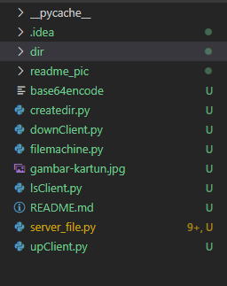
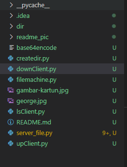
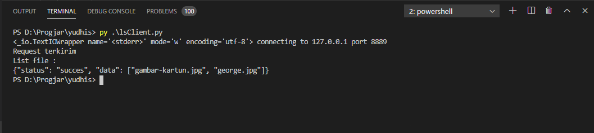

# Tugas 4

* Menjalankan server_file.py

* Meletakkan File/Upload File berupa foto dengan menjalankan upClient.py

Isi folder dir sebelum program dijalankan
    
 
    
Isi folder dir setelah program dijalankan
    

    
Isi gambar
    
  
     
* Mengambil File/Mendownload File berupa foto dengan menjalankan downloadClient.py

Isi directory utama sebelum program dijalankan
    
 
    
 Isi directory utama setelah program dijalankan
    
    
    
    Isi gambar
    
    
* Melihat list dengan menjalankan program lsClient.py

