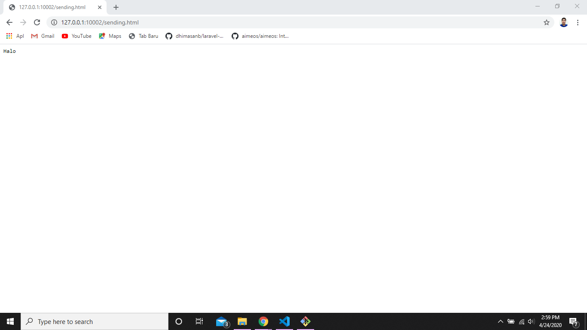
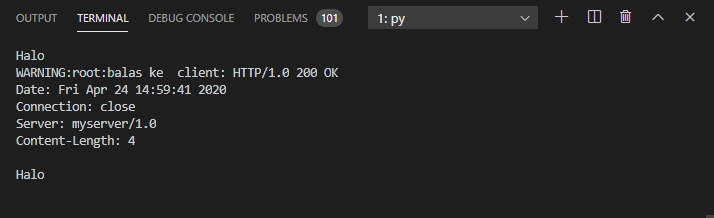

# Tugas 8
## Http Server cara kerja

setelah menjalankan server_thread_http.py lalu buka ip berikut ini http://127.0.0.1:10002/sending.html di browser dan masukan input yang diinginkan:

Hasil setelah input dikirim:

Hasil pada server_thread_http.py:

